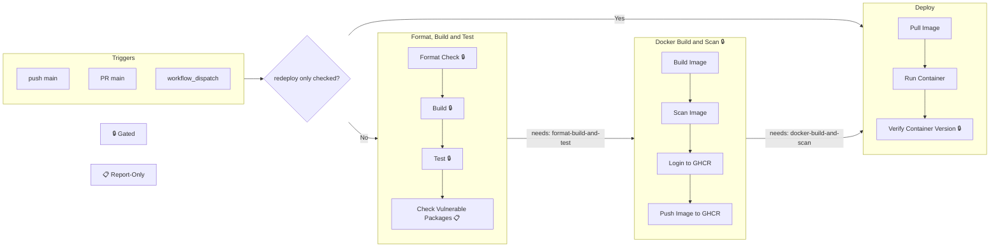

## CI Diagram

```mermaid
---
id: 23af7a34-f54f-4d44-bf4d-329a5449415b
---
flowchart LR

subgraph Triggers[Triggers]
    T1[push main] 
    T2[PR main]
    T3[workflow_dispatch]
end


subgraph J1[Format, Build and Test]
    S1[Format Check 🔒] --> S2[Build 🔒]
    S2 -->S3[Test 🔒]
    S3 --> S4[Check Vulnerable Packages 📋]
end

subgraph J2[Docker Build and Scan 🔒]
    SB1[Build Image] --> SB2[Scan Image]
    SB2 --> SB3[Login to GHCR]
    SB3 --> SB4[Push Image to GHCR]
end

subgraph J3[Deploy]
    SC1[Pull Image] --> SC2[Run Container]
    SC2 --> SC3[Verify Container Version 🔒]
end

G[🔒 Gated]
R[📋 Report-Only]


Triggers --> Gate{redeploy only checked?}
Gate -->|No| J1
Gate -->|Yes| J3
J1 --->|needs: format-build-and-test| J2
J2 --->|needs: docker-build-and-scan| J3
```